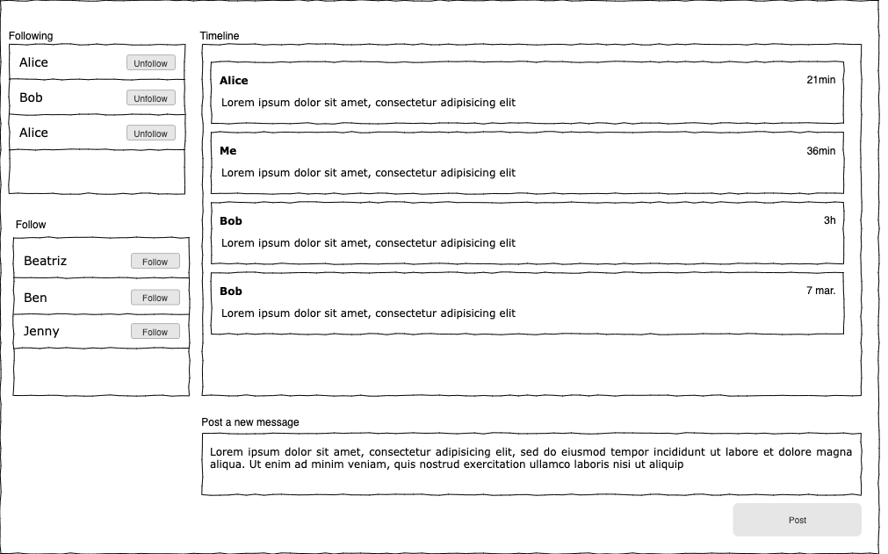

WebTwitter
========================
  
Implement a web-based social networking application (similar to Twitter) satisfying the scenarios below.

**NOTE**: Please it is important that you add instructions about how to run the application.
 
 
<h2>Scenarios</h2> 

**Posting a message**
-  As a user we should be able to add new messages to the timeline 

**Following/Unfollowing a user**
- As a user we should be able to follow or unfollow a user.

**View timeline messages** 
-  Once the main view is accessed, the aggregated list of all messages from users we follow (including mine) will be displayed.
-  When selecting one of the following users, the timeline should only show posts from that user.
-  Again, if no follower is selected, it should show the aggregated message list of all the users you follow.
-  The content of a message should include this info: author name, date, content

<h2>What we are looking for?</h2>
 
* Pay attention about how your code is organized. It's important the domain of the application is reflected in the code.
* We love reusable and scalable code. This is the reason why we pay attention to the separation of concerns between the UI and the business logic.
* We would love to see the usage of the Software Design Patterns, SOLID principles and Clean Architectures.
* We are not fanboys of frameworks/libraries but keep in mind that our front-end stack is based on React.
* We don't think 100% of code coverage is a must, but we love tests.
* We are looking forward to seeing your code and discussing your solution with you.

<h2>How the UI should look like?</h2>

You are not intended to be proven as a designer. The provided mockup are just a guideline, feel free to build whatever you want. You can use a component's library in order to help you to build the UI or code it from scratch, no preference here.

 
 
 

